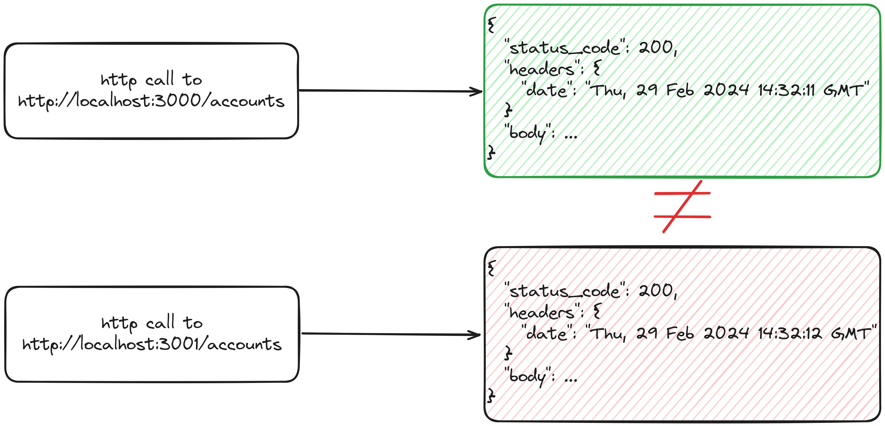
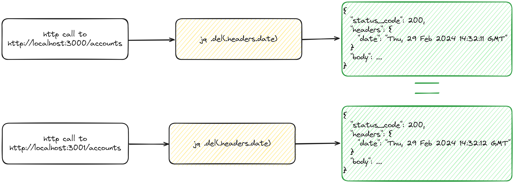
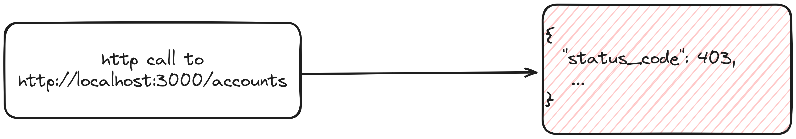
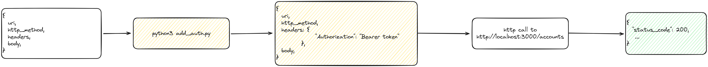

Let's walk though all configuration options.

This is how complete configuration file looks like:

```json
{
  "domains": [
    "http://localhost:3000/",
    {
      "domain": "http://localhost:3001/",
      "headers": {
        "cookie": "auth=test"
      }
    }
  ],
  "endpoints": [
    {
      "endpoint": "/health",
      "variables": null,
      "http_method": null,
      "headers": {
        "x-test": "true"
      },
      "body": null,
      "response_processor": null,
      "request_builder": ["python3", "script.py"]
    },
    {
      "endpoint": "/api/v1/users/<userId>?skip=<skip>",
      "variables": {
        "userId": [123, "true", "UUID"],
        "skip": "UUID"
      },
      "http_method": "GET",
      "headers": null,
      "body": null,
      "response_processor": ["jq", "del(.headers.auth)"],
      "request_builder": null
    },
    {
      "endpoint": "/api/v1/users",
      "variables": null,
      "http_method": "POST",
      "headers": null,
      "body": {
        "username": "test"
      },
      "response_processor": ["jq", "del(.headers.auth, .body.id)"],
      "request_builder": null
    }
  ],
  "variables": null,
  "concurrent_jobs": 20
}
```

- `domains` - is a list of domains to map all endpoints with.
  Order here matters, all requests are compared with the fist domain (`http://localhost:3000/` in this example).

  - domain can be a string representing url
  - domain can be an object with `domain` and `headers` properties.
    - `domain` is the string url
    - `headers` is a map of static headers, like cookies, auth or anything that you want to pass ot this domain in headers.
      All requests to this domain will receive these headers.

- `endpoints` - is a list of endpoints configuration objects
  All domains will be mapped with each endpoints.

  - `endpoint` - uri path like `/health`.
  - `variables` - is a map of variables to insert into endpoint.
    Path that includes variable placeholder will lookup values from here.
    Consider following example:

    ```json
    {
      "endpoint": "/users/<userId>",
      "variables": {
        "userId": [123, 444]
      }
    }
    ```

    will be mapped to:

    `/users/<userId>` will be mapped to `/users/123` and `/users/444`

    Path can hold multiple variables. All variables will be flattened and combinations calculated

    ```json
    {
      "endpoint": "/users/<userId>?skip=<skip>",
      "variables": {
        "userId": [123, 444],
        "skip": ["pending", "approved"]
      }
    }
    ```

    Will be mapped to:

    - `/users/123?skip=pending`
    - `/users/444?skip=pending`
    - `/users/123?skip=approved`
    - `/users/444?skip=approved`

  - `http_method` - is an enum string of http status: `GET | POST | PATCH`, etc...
    Default is `GET`.
  - `headers` is map just like in domain object.
    endpoint headers will be merged with the domain ones.
    Consider this configuration:

    ```json
    {
      "domains": [
        "http://localhost:3000/",
        {
          "domain": "http://localhost:3001/",
          "headers": {
            "Authorization": "Bearer token"
          }
        }
      ],
      "endpoints": [
        {
          "endpoint": "/users",
          "headers": {
            "x-test": "true"
          }
        },
        {
          "endpoint": "/products"
        }
      ]
    }
    ```

    `http-diff` will expand this to:

    - first job with two requests to `/users` endpoint:
      - `http://localhost:3000/users`
        this request will have header:
        ```json
        {
          "x-test": "true"
        }
        ```
        Because `/users` endpoint configuration defines it.
      - `http://localhost:3001/users`
        this request will have header:
        ```json
        {
          "Authorization": "Bearer token"
        }
        ```
        Because `http://localhost:3001/` domain configuration defines it.
    - second job with two requests to `/products` endpoint:
      - `http://localhost:3000/products`
        with no additional headers
      - `http://localhost:3001/products`
        this request will have header:
        ```json
        {
          "Authorization": "Bearer token"
        }
        ```
        Because `http://localhost:3001/` domain configuration defines it.

  - `body`- any valid json value. Will be passed as a request body.

  - `response_processor`- external command that will be launched before comparing the responses.
    Response is then streamed into this process and wait for output. This gives you the ability to modify the response. Can be useful in cases there are extra properties that need to be omitted from the compare process.
    Let's consider this endpoint configuration:

    ```json
    {
      "endpoint": "accounts/"
    }
    ```

    When we make this request to two requests

    - `http://localhost:3000/accounts`
    - `http://localhost:3001/accounts`

    Let's say server responses with timestamp in headers - `date` field.

    Because we can't guarantee servers will respond in exact same time, there is a chance, this `date` property will cause issues and will show up as a diff when comparing two responses.
    

    ```json
    {
      "endpoint": "accounts/<id>",
      "response_processor": ["jq", "del(.headers.date)"]
    }
    ```

    1. Adding this `response_processor` will spin up process `jq del(.header.date)`.
    2. Then `http-diff` will steam original response to it.
    3. `jq` deletes the date property from headers and streams back the modified response.
    4. Responses are then compared with no dates properties `=>` no diffs, all good.
       

  - `request_builder` - same as `response_processor` is an external command. It can be used to build the request itself. It can be any command, program or script that accepts `stdin` and outputs to `stdout`.
    Let's say we have complex authentication system on `http://localhost:3000/accounts` which requires dynamic property to be passed in headers.
    

    By adding `request_builder` that listens to stdin, does whatever it needs to do to add required header and outputs back the object, we can solve this issue
    

- `variables` - is a global map of variables. It's accessible by all endpoints. It's a convenient way to share variables between endpoints.
  Consider this config

  ```json
  {
    "endpoints": [
      {
        "endpoint": "/users/<userId>"
      },
      {
        "endpoint": "/users/<userId>?skip=<skip>",
        "variables": {
          "skip": ["pending", "approved"]
        }
      }
    ],
    "variables": {
      "userId": ["123", "222"]
    }
  }
  ```

  That will be mapped to

  - `/users/123`
  - `/users/222`
  - `/users/123?skip=pending`
  - `/users/222?skip=approved`

- `concurrent_jobs` - amount of requests to execute. Defaults to 20
