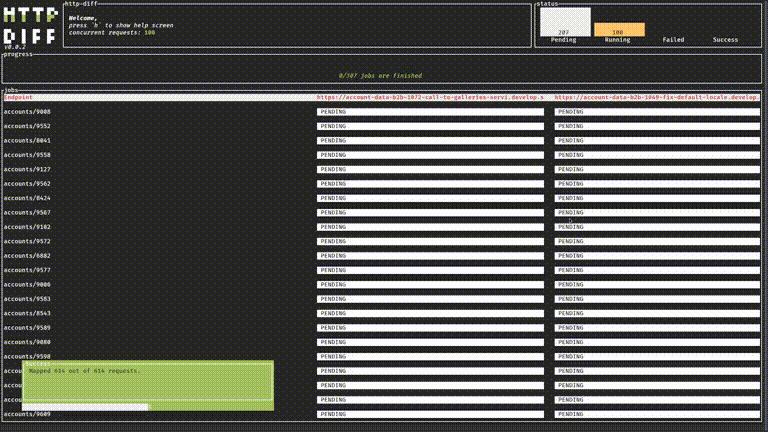

## http-diff

CLI tool to verify consistency across web server versions. Ideal for large-scale refactors, sanity tests and maintaining data integrity across versions.

Archives of precompiled binaries for http-diff are available for macOS and Linux on [every release](https://github.com/syte-ai/http-diff/releases).

[](https://github.com/syte-ai/http-diff)
[](https://crates.io/crates/http-diff)

Dual-licensed under MIT or the [UNLICENSE](https://unlicense.org/).



The tool works by looking at the configuration file that can be specified by `--configuration` argument.

`http-diff --configuration=./configuration.json`

- `./configuration.json` - is the default value for this argument so it can be omitted.

## Config example:

```json
{
  "domains": ["http://domain-a.com", "http://stage.domain-a.com"],
  "endpoints": [
    {
      "endpoint": "/health"
    },
    {
      "endpoint": "/api/v1/users/<userId>"
    }
  ],
  "variables": {
    "userId": [123, 444]
  }
}
```

this config will be translated to following:

- `GET` request will be issued to `http://domain-a.com/health` and response be compared to response of `GET http://stage.domain-a.com/health`.

- Next endpoint `/api/v1/users/<userId>` has variable defined in it - `<userId>`. Anything within the brackets considered a variable name. In this case - `userId`.
  Variable then is looked up in the global variables property. In this case `userId` has two values: `123` and `444`. This will be mapped to following requests:

  - `GET http://domain-a.com/users/123` and compared with response from `GET http://stage.domain-a.com/users/123`.
  - `GET http://domain-a.com/users/444` and compared with `GET http://stage.domain-a.com/users/444`.

All configuration options can be found [here](CONFIGURATION.md).

## Installation

Archives are available on [every release](https://github.com/syte-ai/http-diff/releases) as well as `.deb` files for Linux.

Autocomplete for arguments and man pages are included.

### (brew tap) Apple & Linux

Tap the repository by running this command:

```bash
brew tap syte-ai/http-diff https://github.com/syte-ai/http-diff
```

and install the package:

```bash
brew install http-diff
```

### .deb file for Linux

Download `.deb` file from [latest release](https://github.com/syte-ai/http-diff/releases) and install it using one of the commands:

```bash
sudo apt install ./path/to/http-diff.deb
```

or

```bash
sudo dpkg -i ./path/to/http-diff.deb
```

## Developing

- `cargo run` - for development
- `cargo test` - to run tests
- `cargo build -r` - to build in release mode
